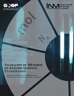
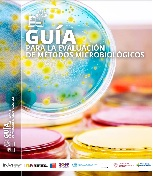
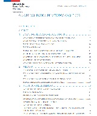
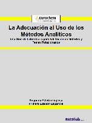
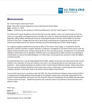
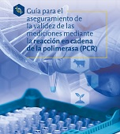

---
title: Guías de validación y verificación de métodos analíticos
author: Cristian Guzman
date: '2023-12-24'
slug: gu-as-de-validaci-n-y-verificaci-n-de-m-todos-anal-ticos
categories:
  - Método analítico
tags:
  - Método analítico
subtitle: ''
summary: ''
authors: []
lastmod: '2023-12-24T14:30:20-05:00'
featured: no
draft: no
image:
  ---
  caption: 'Image credit: [**Clipdrop by stability.ai**]'
  focal_point: ""
  placement: 2
  preview_only: false
projects: []
subtitle: "La importancia de las guías en los aspectos de validación y verificación de métodos permiten a los laboratorios poder planear, desarrollar y presentar la documentación suficiente para obtener evidencia objetiva en las auditorias de acreditación."
summary: "La importancia de las guías en los aspectos de validación y verificación de métodos permiten a los laboratorios poder planear, desarrollar y presentar la documentación suficiente para obtener evidencia objetiva en las auditorias de acreditación."
---

Una de las practicas principales de calidad y acreditación de los laboratorios es verificar o validar los métodos analíticos con el propósito de demostrar el uso adecuado con evidencia objetiva a las entidades gubernamentales y privadas, garantizando que los datos entregados al cliente son de alta confianza, por esta razón una práctica frecuente de los laboratorios es redactar un documento que en su contenido tenga los pasos para realizar estas actividades.

En diferentes ocasiones los laboratorios no cuentan con bases solidas para desarrollar este tipo de documentos concurriendo en errores, por esta razón es de gran importancia la búsqueda bibliográfica que se desarrolle en estos temas, teniendo el cuidado de no adquirir información dudosa o carente de acervo científico. Al personal que se le asigna esta tarea debe tener en cuenta que es de minucioso cuidado y es recomendable que el mismo tenga capacitaciones o el suficiente grado de manejo en materia estadística y metrológica. 

La documentación recomendable siempre será la normalizada como el caso de las ISO, pero a la fecha esta en desarrollo la norma ISO/IEC AWI TR 17035 referente al tema de validación y verificación de métodos y no ha sido aprobada, en estos casos solo queda recomendar las guías entregadas por las diferentes entidades publicas y privadas, como son los institutos nacionales de metrología.

Una serie de guías gratuitas recomendadas son las siguientes:

Procedencia | Guía | Imagen
:---: | :---: | :---:
[*INM*](https://inm.gov.co/web/) | [Validación de métodos en análisis químico cuantitativo](https://inm.gov.co/web/wp-content/uploads/2023/05/Guia_ValidacionMetodosAnalisisQuimicoCuantitativo-16.pdf) |  
[*INM*](https://inm.gov.co/web/) | [Guía de Microbiología de INM](https://inm.gov.co/web/wp-content/uploads/2023/11/Guia_microbiologia_INM.pdf) | 
[*SERNAPESCA*](https://www.sernapesca.cl/)| [GUÍA DE VALIDACIÓN DE MÉTODOS ANALÍTICOS](https://www.sernapesca.cl/app/uploads/2023/11/f59_guia_de_validaciones_de_metodos_analiticos_08.02.18.pdf) | 
[*Eurachem*](https://www.eurachem.org/index.php) | [La Adecuación al Uso de los Métodos Analíticos](https://www.eurachem.org/images/stories/Guides/pdf/MV_guide_2nd_ed_ES.pdf) | 
[*FDA*](https://www.fda.gov/) | [Guidelines for the Validation of Chemical Methods in Food, Feed, Cosmetics, and Veterinary Products ](https://www.fda.gov/media/81810/download?attachment) | 
[*INM*](https://inm.gov.co/web/) | [Guía para el aseguramiento de la validez de las mediciones mediante la reacción en cadena de la polimerasa (PCR)](https://inm.gov.co/web/wp-content/uploads/2023/11/Guia-de-PCR-final-1.pdf) | 
[*Eurachem*](https://www.eurachem.org/index.php)| [Acreditación de Laboratorios Microbiológicos (2023)](https://www.eurachem.org/images/stories/Guides/pdf/Eurachem_Guide_AML_2023_EN.pdf) | 

## Bibliografía


<script src="https://utteranc.es/client.js"
        repo="cristianJGD/comen"
        issue-term="pathname"
        theme="gruvbox-dark"
        crossorigin="anonymous"
        async>
</script>

```


